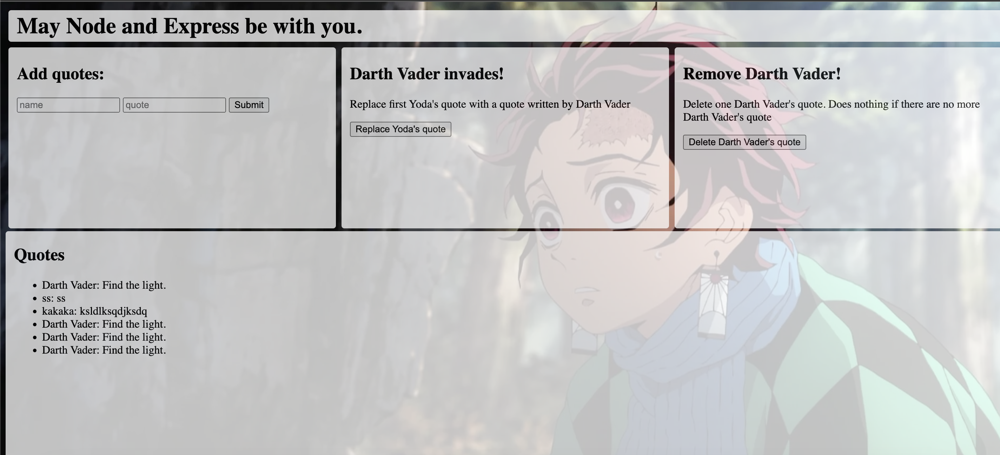

# Build a simple crud app with Node, Express, and MongoDB
### Based on the amazing walkthrough [Zellwk](https://zellwk.com/blog/crud-express-mongodb")

## Steps: the server.js file on line 4 and 5
-   1: Replace `username` with your Database username
-   2: Replace `password` with the Database user’s password

### END PROJECT

### DISCLAIMER: This repo was created only to help people if they get stuck
